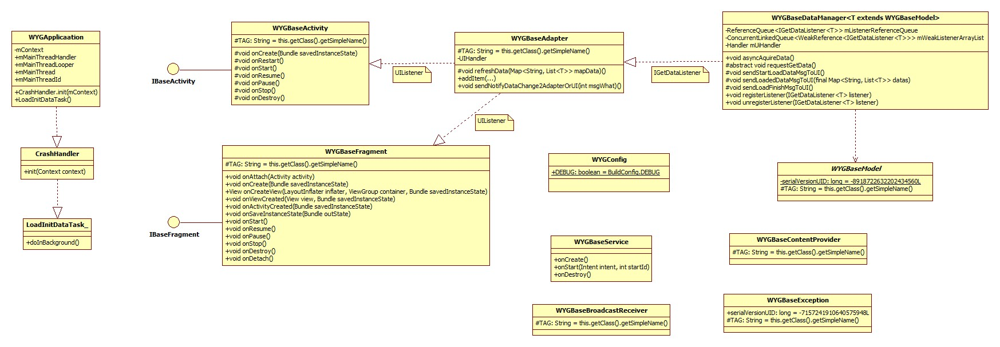

# Android-BaseProject

a base project for starting a new project , or rebuild your old project.

----------

本文初衷：由于很多Android项目的基础框架大致一致，于是针对主流的Android项目基础需求，严格按照MVC模式进行基类代码封装，以便可以将工程应用到任何一个新项目开发中，或者在代码重构时引入。框架抽取存在可优化性，以及针对具体场景可针对性低优化，由于代码量少使用起来非常简单，本文就简单介绍，可在底部直接下载源码，分分钟理解源码。欢迎提出意见或建议。

----------

###本项目所遵循的MVC模式

MVC的概念就不多介绍了，请自行glgoo，或者百度。本项目的MVC模式图如下所示：

###大致设计思路
Activity作为V视图显示层，适配器adapter和数据中心manager作为C控制层，模式对象model及数据库持久化作为Model模型层。由manager作为数据获取的入口，负责数据的获取、处理，将处理好的数据通过IGetDataListener接口回调给适配器，适配器拿到数据填充视图，同时通过接口UIListener回调给Activity进行UI动作刷新。另外manager处理好的数据由继承类进行数据化持久或者内存缓存等操作。

- IGetDataListener接口设计
	
工作在主线程，接口定义数据获取开始，获取中以及获取结束的方法，通过这三个方法将异步线程处理的数据进度以及具体内容抛到主线程。

	public interface IGetDataListener<T> {
        /** 开始获取数据 */
        public void startLoadData();

        /** 获取到数据 从异步线程抛到这里 */
        public void loadedData(Map<String, List<T>> datas);

        /** 结束获取数据 */
        public void loadDataFinish();
    }
	
- UIListener接口设计
	
工作在主线程，类似与IGetDataListener，接口定义数据获取开始，获取中以及获取结束的方法，通过这三个方法将适配器数据量的处理进度与结果通知给UI,让UI刷新所需的功能。

	public static interface UIListener {
        /** 正在加载数据 */
        void isLoading();

        /** 总数据个数变化 */
        void dataCountChanged(int count);

        /** 加载数据完毕 */
        void loadFinished();
    }

- 基类抽取封装

	项目中对Android四大组件进行了必要的封装抽取基类，主要已抽象类加接口的模式设计，便于扩展以及开发。类图如下所示：

	

	1. Application启动入口
		
		获取主线程的一些信息，包括全局上下文、主线程、主线程handler、主线程Looper、主线程Id,初始化未捕获异常管理器	，以及异步加载其他初始化数据。	

	2. Activity基类

		抽象基类，实现IBaseActivity接口，子类只需实现三个方法即可。

		public interface IBaseActivity {

			/**
			 * 绑定渲染视图的布局文件
			 * 
			 * @return 布局文件资源id
			 */
			public int bindLayout();
		
			/** 初始化控件 */
			public void findViews(final View v);
		
			/**
			 * 业务处理操作（onCreate方法中被调用） 
			 * 数据逻辑及业务操作在此方法中 
			 * 
			 * @param mContext
			 *            当前Activity对象上下文
			 */
			public void doBusiness(Context context);
		
		}

	3. Fragment基类

		抽象基类，实现IBaseFragment接口，使用V4包，兼容低版本。子类只需实现三个方法即可。

		public interface IBaseFragment {

			/**
			 * 绑定渲染视图的布局文件
			 * 
			 * @return 布局文件资源id
			 */
			public int bindLayout();
		
			/** 初始化控件 (onCreateView方法中调用) */
			public void findView(final View v);
		
			/**
			 * 业务处理操作（onViewCreated方法中调用）
			 * 
			 * @param mContext
			 *            当前Activity对象上下文
			 */
			public void doBusiness(Context context);
		}

	4. Service基类

		抽象基类

	5. BroadcastReceiver基类

		抽象基类

	6. ContentProvider基类

		抽象基类

	7. Exception基类

		抽象基类	

	8. Model基类

		抽象基类

	9. Adapterj基类
		
		抽象基类，子类需调用refreshData(Map<String, List<T>> mapData)加载视图数据，在加载过程中会将进度通知到UI显示，该基类定义UIListener接口，该接口负责adapter与UI进行视图交互。

	10. DataManager基类

		抽象基类，该基类定义IGetDataListener接口，该接口负责将异步数据交给主线程的adapter处理。 同时封装了注册、取消注册监听的接口，需要使用者进行注册和取消注册，调用asyncAquireData方法启动数据获取，具体获取数据由子类在requestGetData()方法中实现。并通过 sendStartLoadDataMsgToUI()、sendLoadedDataMsgToUI(final Map<String, List<T>> datas)、sendLoadFinishMsgToUI()三个方法通知UI数据的处理进度。